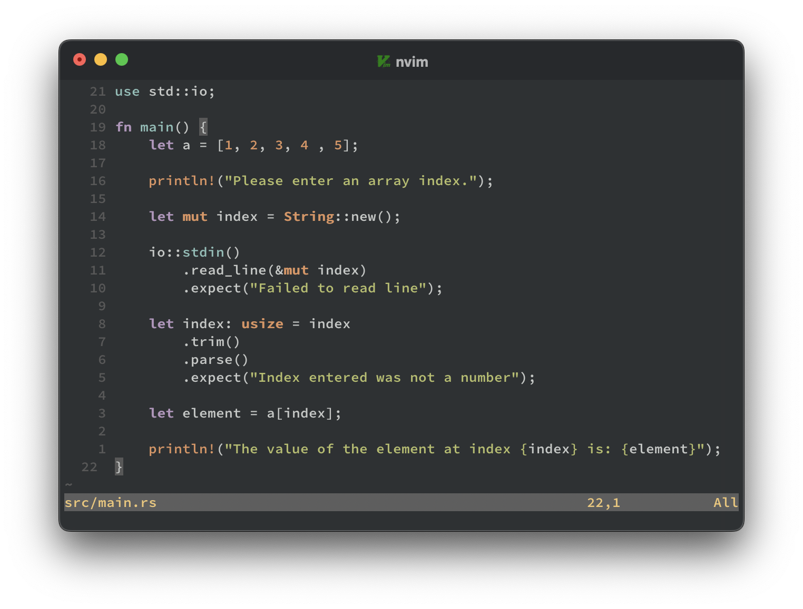

## Features

- Supports Treesitter & LSP
- Vim terminal colours

## Installation

Using [lazy.nvim](https://github.com/folke/lazy.nvim):

```lua
require("lazy").setup({
  "namrabtw/rusty.nvim",
  version = false,
  lazy = false,
  priority = 1000, -- make sure to load this before all the other start plugins
})
```

Using [packer.nvim](https://github.com/wbthomason/packer.nvim):

```lua
use 'namrabtw/rusty.nvim'
```

Using [vim-plug](https://github.com/junegunn/vim-plug):

```viml
Plug 'namrabtw/rusty.nvim', { 'branch': 'main' }
```

## Usage

```viml
" In VimL

colorscheme rusty
```

```lua
-- In Lua
vim.cmd([[colorscheme rusty]])

-- Alternatively
require("rusty").load()
```
